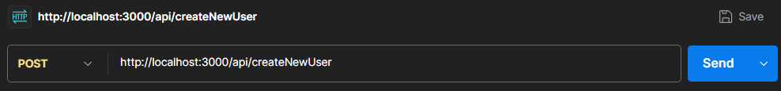
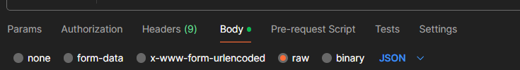
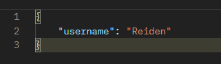
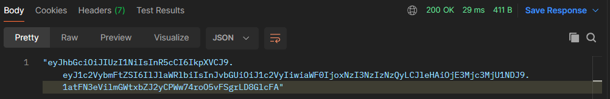
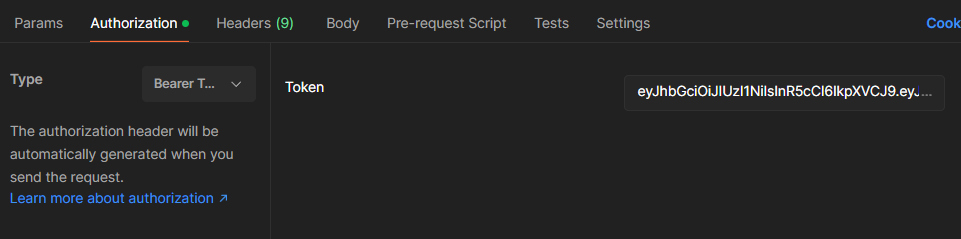
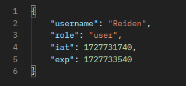

# JWT Learning Activity

### By: Reiden Webber | Date: September 30, 2024

## JWT Walkthrough

*This activity alters some of the following code but keeps the intended functionality.*

[How To Use JSON Web Tokens (JWTs) in Express.js | DigitalOcean](https://www.digitalocean.com/community/tutorials/nodejs-jwt-expressjs)

## Repo @ Token-learning Branch

[GitHub - gt-grouporder/backend at Token-learning](https://github.com/gt-grouporder/backend/tree/Token-learning)

## Postman Replication

### Setup

1. Checkout on the “Token-learning” branch. If it does not exist then pull from the repository

```jsx
> git checkout Token-learning
```

2. Start the Server

```jsx
> npm start
```

3. Bootup Postman and sign in (either guest or user account)

### Generating a Token

1. Set to **POST** then put in the host server url + the API route createNewUser



2. Go to the Body tab, select the raw radio button, then select JSON from the drop down menu.



3. Add the JSON with username and custom text for the user



4. Press the **Send** button, then if everything goes smoothly, the output should have a generated token.



### Authenticating a Token

1. [Optional] Create a new request tab using the “+”
2. Set to **GET** then put in the host server url + the API route userOrder


3. Go to the authorization tab, select the “Bearer Token” type, and paste the token from the output of generating the token (without quotations).



4. Press send, and you should see the following with username being replaced with your custom username. “iat” and “exp” refer to the time the token was issued and expires respectively.



### Note on Client-side Cookies

The code base should have client-side cookies already implemented. This means that you do not have to input the token manually when authenticating. Try it and see for yourself!